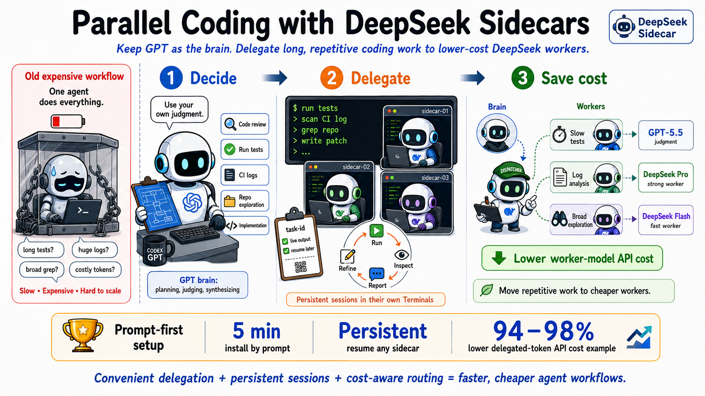

English | [中文](README.md)

**Give Codex a persistent DeepSeek subagent for parallel coding tasks.**

🔥 **Now supports Codex, Claude Code, and OpenCode**

Delegate code reviews, debugging, research, and other bounded tasks without interrupting your main Codex workflow. The expensive GPT stays the brain — planning, judging, synthesizing — while cheaper DeepSeek workers handle long tests, log analysis, broad exploration, and other token-heavy execution. Each task runs in its own Terminal with live output and keeps its full session context.

When the task finishes, the Terminal becomes an interactive `deepseek>` prompt for follow-ups. You can close it, check status by task ID, and resume the same session later.

**No third-party proxy required. Flash talks directly to DeepSeek's official native Responses API; only Pro/Beta still use the included local proxy. 🚀**


<p align="center">
  
</p>

## 🚀 You only need these prompts

This skill is meant to be read and executed by Codex, not memorized by humans. On a machine with Codex CLI, Python 3, and a DeepSeek key, Codex should have everything running in about five minutes.

### Install — give this repo to Codex

```text
Install and configure https://github.com/Zedong-Liu/codex-deepseek-sidecar.
I have a DeepSeek API key — ask me for it if it's not configured on this machine yet.
Flash uses the official native Responses API by default. If a Pro/Beta profile needs the local proxy, start it and keep it running for those sidecar tasks.
Then launch a DeepSeek sidecar for this repo to handle long or log-heavy tasks.
```

### Delegate a task

```text
Use a DeepSeek sidecar to run the slow tests while you review the code.
```

```text
Use a DeepSeek sidecar to analyze this CI log and find the real failure.
```

```text
Use your own judgment on when to split work across DeepSeek sidecars.
Auto-dispatch for tests, log analysis, and broad exploration, then synthesize results.
```

## ✨ Why use it

- 💸 **Dramatically lower worker token cost** — shift repeated file reads, log inspection, test runs, and broad exploration from expensive GPT tokens to DeepSeek worker tokens. Many workflows target an **80–90% lower token cost**.
- **No third-party proxy needed** — the Flash profile connects directly to DeepSeek's official native Responses API (`wire_api = "responses"`), with the credential supplied through Codex's official Keychain-backed `auth.command`; only Pro/Beta still use the small built-in Python proxy bridge.
- **GPT stays the brain** — the expensive model handles planning, judgment, and synthesis; DeepSeek handles bounded worker tasks.
- **Still Codex harness** — sidecars retain Codex file access, command execution, sessions, and evidence reporting.

## 💸 Cost estimate

Prices per 1M tokens, based on [OpenAI GPT-5.5 model page](https://developers.openai.com/api/docs/models/gpt-5.5/) and [DeepSeek pricing docs](https://api-docs.deepseek.com/quick_start/pricing). DeepSeek Pro input price uses cache-miss for a conservative estimate.

| Model | Best role | Input | Output |
| ---- | ---- | ----: | ----: |
| GPT-5.5 | Brain: planning, judgment, synthesis | $5.00 | $30.00 |
| DeepSeek V4 Pro | Strong worker: review, debug, implement | $0.435 | $0.87 |
| DeepSeek V4 Flash | Fast worker: logs, exploration, cheap parallel passes | $0.14 | $0.28 |

At `1M input + 200K output`:

| Routing | Approx cost | Token cost reduction |
| ---- | ----: | ----: |
| All GPT-5.5 | $11.00 | baseline |
| DeepSeek V4 Pro worker tokens | $0.61 | ~94% |
| DeepSeek V4 Flash worker tokens | $0.20 | ~98% |

In real use, GPT still spends tokens on coordination and review. That is the point: spend expensive tokens on judgment, move repetitive worker-token budgets to DeepSeek. For many agent workflows, **80–90% token cost save** is a realistic target.

## 🧠 What Codex does behind the scenes

When you ask Codex to use this skill, it can:

- Install the repo as a Codex skill.
- Connect Flash directly to the official native Responses API; start the built-in lightweight proxy only when Pro/Beta needs it.
- Configure a Codex profile once so future tasks skip cold-start setup.
- Launch DeepSeek sidecars for bounded tasks.
- Track task IDs and sessions so follow-ups resume to the correct worker.
- Collect sidecar conclusions and synthesize them into the main response.

These operational details belong in [SKILL.md](SKILL.md), not in front of human readers.

## 🔌 Transport: official native API + built-in proxy (Pro/Beta fallback)

The Flash profile now uses DeepSeek's officially recommended Codex integration:
Codex talks directly to `https://api.deepseek.com/` via the Responses API with no
translation layer. The API key is never written to `config.toml`; Codex's
`[model_providers.<id>.auth]` command fetches it from the macOS Keychain item
`codex-deepseek-official`. DeepSeek's docs currently enable Codex integration
only for `deepseek-v4-flash` (Pro is expected in early August 2026), so
`ds-sidecar-local` (Pro) and `ds-sidecar-beta` keep using the built-in proxy
until then.

The bundled `deepseek-responses-proxy` is intentionally minimal: Python stdlib only, localhost by default, designed for Codex's large request bodies. It bridges function tools; when V4 Flash emits a tool call as DSML text rather than an API `tool_calls` field, it restores the call to a structured function call before Codex sees it (including for streaming output), so a tool request cannot be mistaken for a final answer. It ignores Responses built-in tools that DeepSeek Chat does not support, returning a clear error if one is explicitly required. It connects only to the official `https://api.deepseek.com` API. Supply credentials from an environment variable or private key file; never commit a key or put one in a profile or prompt.

## 🛠️ Stable operation and sessions

First store the DeepSeek API key in the macOS Keychain item
`codex-deepseek-official` for the current user (or use `DEEPSEEK_API_KEY` /
`DEEPSEEK_API_KEY_FILE` elsewhere), then configure and verify:

```bash
scripts/codex-deepseek-subagent --configure
```

`--configure` only writes sidecar profile files under `~/.codex/` and never
touches the top-level `model` / `model_provider` / auth keys of
`~/.codex/config.toml`, so your ChatGPT/Codex login state stays intact. Do
**not** run DeepSeek's official one-click script
(`bash <(curl -fsSL https://cdn.deepseek.com/api-docs/codex-deepseek-setup.sh)`)
against your real config: it rewrites the global config and hides the ChatGPT
login session group. This skill implements the same official provider settings
inside sidecar profiles instead. Pro/Beta still need the local proxy (launchd
service `com.captainliu.deepseek-sidecar-proxy`):

```bash
curl -fsS http://127.0.0.1:12359/v1/ready
```

The default profile is DeepSeek V4 Flash on the stable API with thinking effort
`max`. Use `--profile ds-sidecar-local` (Pro) for a stronger worker;
`--effort high|max` overrides thinking effort, and persisted sessions remember
their selected profile and effort:

```bash
# Default: Flash + max
scripts/codex-deepseek-subagent --cd "$PWD" "<task>"

# Cheaper/faster Flash turn
scripts/codex-deepseek-subagent --effort high --cd "$PWD" "<task>"

# Escalate to Pro
scripts/codex-deepseek-subagent --profile ds-sidecar-local --cd "$PWD" "<task>"
```

Each execution opens a Terminal monitor with wrapper-verified model, effort,
profile, live output, and a `deepseek >` follow-up prompt. Raw reasoning is not
rendered to users; the proxy preserves it opaquely only when a tool-call
continuation requires it. `/metrics` exposes aggregate cache hit/miss counts
only—never prompts, tool arguments, or keys. Re-run `--configure` after a Codex
upgrade to refresh local model metadata.

## 🧩 Framework adapters

Codex remains the main, stable entrypoint. Other framework adapters live in their own install surfaces so they do not change the Codex skill behavior:

- `.opencode/` contains the OpenCode adapter and OpenCode skill.
- `.claude-plugin/` plus `skills/claude-deepseek-sidecar/` contains the Claude Code adapter.

## 📦 Repo layout

```text
.
├── .claude-plugin/
├── .opencode/
├── SKILL.md
├── agents/openai.yaml
├── skills/claude-deepseek-sidecar/
├── scripts/codex-deepseek-sidecar
├── scripts/codex-deepseek-subagent
├── scripts/codex-deepseek-keychain-token
├── scripts/deepseek-responses-proxy
├── scripts/refresh-codex-model-catalog
└── scripts/terminal-chat
```

## License

Apache 2.0 — see [LICENSE](./LICENSE).
