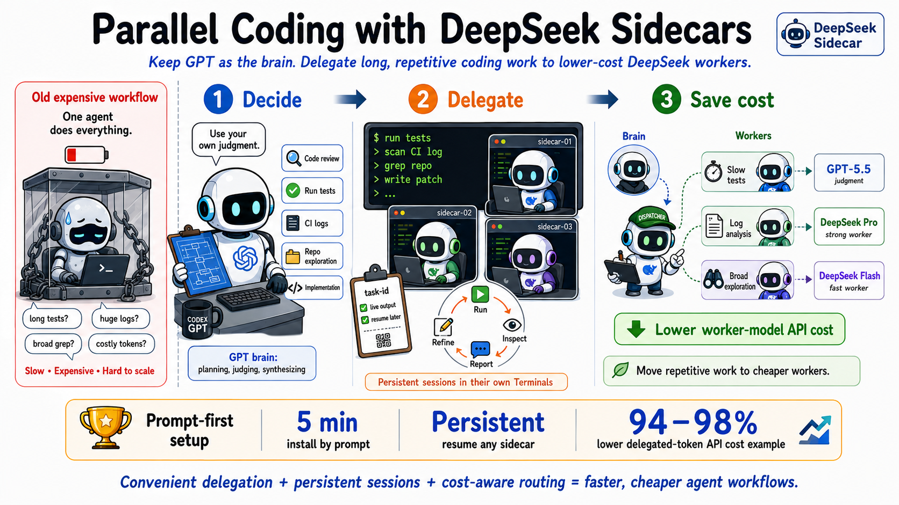

# codex-deepseek-sidecar
[中文](README.zh-CN.md) | English

**Give Codex a persistent DeepSeek subagent for parallel coding tasks.**

Delegate code reviews, debugging, research, and other bounded tasks without interrupting your main Codex workflow. The expensive GPT stays the brain — planning, judging, synthesizing — while cheaper DeepSeek workers handle long tests, log analysis, broad exploration, and other token-heavy execution. Each task runs in its own Terminal with live output and keeps its full session context.

When the task finishes, the Terminal becomes an interactive `deepseek>` prompt for follow-ups. You can close it, check status by task ID, and resume the same session later.

**No external proxy required. Bring your own DeepSeek key. Codex handles the rest. 🚀**


<p align="center">
  
</p>

## 🚀 You only need these prompts

This skill is meant to be read and executed by Codex, not memorized by humans. On a machine with Codex CLI, Python 3, and a DeepSeek key, Codex should have everything running in about five minutes.

### Install — give this repo to Codex

```text
Install and configure https://github.com/Zedong-Liu/codex-deepseek-sidecar.
I have a DeepSeek API key — ask me for it if it's not configured on this machine yet.
If a local proxy or profile needs to be set up, handle that too.
Then launch a DeepSeek sidecar for this repo to handle long or log-heavy tasks.
```

### Delegate a task

```text
Use a DeepSeek sidecar to run the slow tests while you review the code.
```

```text
Use a DeepSeek sidecar to analyze this CI log and find the real failure.
```

```text
Use your own judgment on when to split work across DeepSeek sidecars.
Auto-dispatch for tests, log analysis, and broad exploration, then synthesize results.
```

## ✨ Why use it

- 💸 **Dramatically lower worker token cost** — shift repeated file reads, log inspection, test runs, and broad exploration from expensive GPT tokens to DeepSeek worker tokens. Many workflows target an **80–90% lower token cost**.
- **No external proxy needed** — a small built-in Python proxy bridges Codex Responses API to DeepSeek Chat Completions.
- **GPT stays the brain** — the expensive model handles planning, judgment, and synthesis; DeepSeek handles bounded worker tasks.
- **Still Codex harness** — sidecars retain Codex file access, command execution, sessions, and evidence reporting.

## 💸 Cost estimate

Prices per 1M tokens, based on [OpenAI GPT-5.5 model page](https://developers.openai.com/api/docs/models/gpt-5.5/) and [DeepSeek pricing docs](https://api-docs.deepseek.com/quick_start/pricing). DeepSeek Pro input price uses cache-miss for a conservative estimate.

| Model | Best role | Input | Output |
| ---- | ---- | ----: | ----: |
| GPT-5.5 | Brain: planning, judgment, synthesis | $5.00 | $30.00 |
| DeepSeek V4 Pro | Strong worker: review, debug, implement | $0.435 | $0.87 |
| DeepSeek V4 Flash | Fast worker: logs, exploration, cheap parallel passes | $0.14 | $0.28 |

At `1M input + 200K output`:

| Routing | Approx cost | Token cost reduction |
| ---- | ----: | ----: |
| All GPT-5.5 | $11.00 | baseline |
| DeepSeek V4 Pro worker tokens | $0.61 | ~94% |
| DeepSeek V4 Flash worker tokens | $0.20 | ~98% |

In real use, GPT still spends tokens on coordination and review. That is the point: spend expensive tokens on judgment, move repetitive worker-token budgets to DeepSeek. For many agent workflows, **80–90% token cost save** is a realistic target.

## 🧠 What Codex does behind the scenes

When you ask Codex to use this skill, it can:

- Install the repo as a Codex skill.
- Start the built-in lightweight proxy if no local DeepSeek provider is available.
- Configure a Codex profile once so future tasks skip cold-start setup.
- Launch DeepSeek sidecars for bounded tasks.
- Track task IDs and sessions so follow-ups resume to the correct worker.
- Collect sidecar conclusions and synthesize them into the main response.

These operational details belong in [SKILL.md](SKILL.md), not in front of human readers.

## 🔌 Built-in proxy

The bundled `deepseek-responses-proxy` is intentionally minimal: Python stdlib only, localhost by default, designed for Codex's large request bodies. It bridges function tools and ignores Responses built-in tools that DeepSeek Chat does not support, returning a clear error if one is explicitly required.

If you already use VibeAround or another compatible provider, Codex can keep using that instead.

## 📦 Repo layout

```text
.
├── SKILL.md
├── agents/openai.yaml
├── scripts/codex-deepseek-sidecar
├── scripts/codex-deepseek-subagent
├── scripts/deepseek-responses-proxy
└── scripts/terminal-chat
```

## License

Apache 2.0 — see [LICENSE](./LICENSE).
